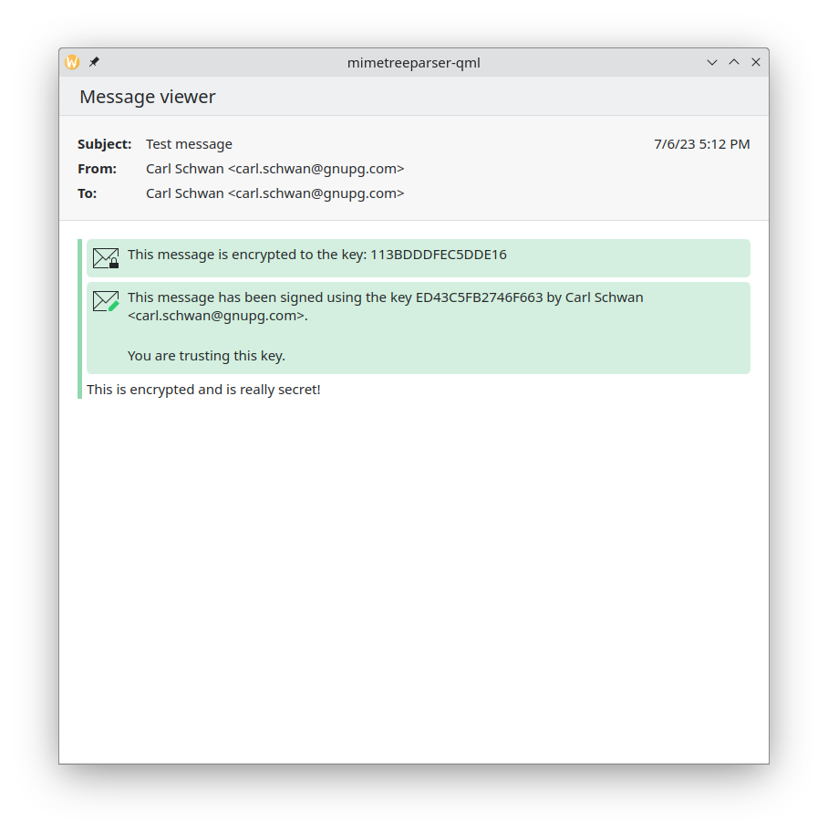
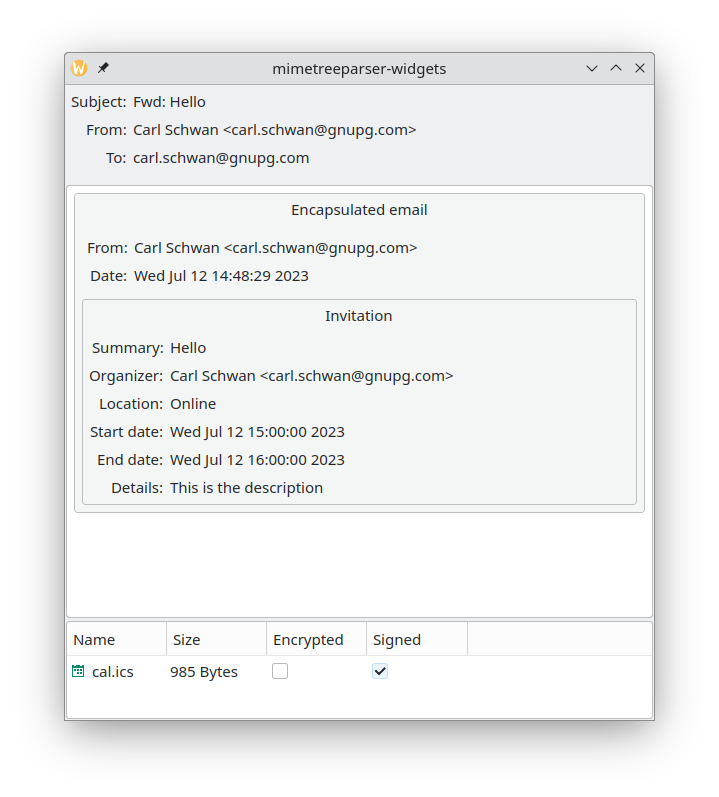

# MimeTreeParser

This repository contains a parser for a MIME tree and is based on KMime. The
goal is given a MIME tree to extract a list of parts (e.g. text, html) and a
list of attachments, check the validity of the signatures and decrypt any
encrypted part.

## Example

Example usage of this library can be found in the examples folder.

QML usage (examples/qml):

Widgets usage (examples/widgets):

## License

This project is licensed under the GNU General License (GPL-2.0-only AND GPL-2.0-or-later). New files are expected to be licensed under the GPL-2.0-or-later.
